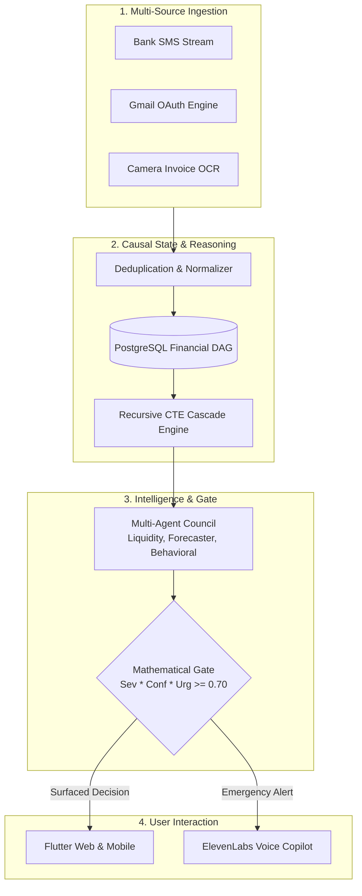

# Finova

Autonomous Financial Intelligence Platform for Variable-Income Earners

An intelligent system that converts fragmented financial signals into proactive, explainable decisions.

Built for CSI ORIGIN 2026

---

## Team Details

Team Name: Cyber Catalysts

```
      \ O /            \ O /            \ O /            \ O /
        |                |                |                |
       / \              / \              / \              / \
  [Prodhosh VS]  [Sri Saidhakshini]  [Gowreesh VT]    [Avanthika]
```

* Prodhosh VS
* Sri Saidhakshini
* Gowreesh VT
* Avanthika

---

## Problem Statement

Variable-income earners—such as freelancers, gig workers, and contractors—receive financial information scattered across transactional SMS, bank emails, PDF statements, physical bills, and platform payout notifications.

Current personal finance applications only log historical transactions after they occur. They do not help users understand:
1. What changed across income streams and scheduled obligations.
2. How an income delay cascades to downstream bills and rent deadlines.
3. What exact counter-measures should be taken before a liquidity shortfall occurs.

---

## Solution Overview

Finova continuously ingests financial events, builds a dynamic causal state graph in PostgreSQL, detects downstream cascade failures using recursive graph traversal, and deliberates mitigation actions through an ensemble of specialized AI agents.

### System Architecture



---

## App Previews

<p align="center">
  
  
  
  
  

</p>

---

## Core Capabilities

1. **Multi-Source Ingestion Pipeline**: Ingests transactional SMS, polls Gmail receipts via OAuth with idempotent hashing, and extracts bills through camera OCR powered by Gemini Vision.
2. **PostgreSQL Causal Graph**: Models financial relationships as a directed acyclic graph (Inflow -> Buffer -> Outflow Obligations).
3. **Deterministic Cascade Traversal**: Executes PostgreSQL Recursive Common Table Expressions (CTEs) on balance updates to calculate exact deficit dates and shortfall amounts without LLM hallucinations.
4. **Multi-Agent Deliberation Council**: Specialized agents (Liquidity Auditor, Gig Forecaster, Behavioral Gatekeeper) evaluate downstream impact and form concrete mitigation options.
5. **Mathematical Intervention Gate**: Computes `Severity * Confidence * Urgency` to suppress noise and prevent notification fatigue.
6. **Real-Time Speech-to-Speech**: Integrates ElevenLabs neural voice synthesis and Web Speech API for voice briefings and interactive voice copilot interactions.

---

## Technology Stack

| Component | Technologies |
| :--- | :--- |
| Frontend | Flutter Web & Mobile, Dart |
| Backend | Node.js, Express, TypeScript |
| Database & Graph | PostgreSQL, Prisma ORM, Recursive CTE Queries |
| AI & Vision | Google Gemini 2.5 Flash, Gemini Vision |
| Voice Engine | ElevenLabs Neural Voice API |
| Ingestion & Auth | Google OAuth 2.0, Gmail API, Regex Tokenizers |
| Infrastructure | Docker, Docker Compose, Nginx |

---

## Quick Start

### Option 1: Docker Compose

```bash
git clone https://github.com/srisaidhakshini/csi-origins.git
cd csi-origins
docker compose up --build
```

Access services:
* Web Application: http://localhost:8080
* Backend API: http://localhost:3000
* Prisma Studio: http://localhost:5555

### Option 2: Local Development

```bash
# Backend
cd backend
npm install
npx prisma generate
npx prisma db push
npm run dev

# Frontend
cd ../mobile
flutter run -d chrome
```

---

## Key Differentiators

* **Proactive Over Reactive**: Detects future cashflow failure points days before they occur.
* **Deterministic Core**: Balances and graph cascades are calculated with exact relational math, reserving generative models for explanation and natural language interfaces.
* **Zero Alert Fatigue**: Quantitative gate scores eliminate non-actionable notifications.
* **Voice-First Experience**: Supports incoming emergency audio warnings and real-time voice conversations.
