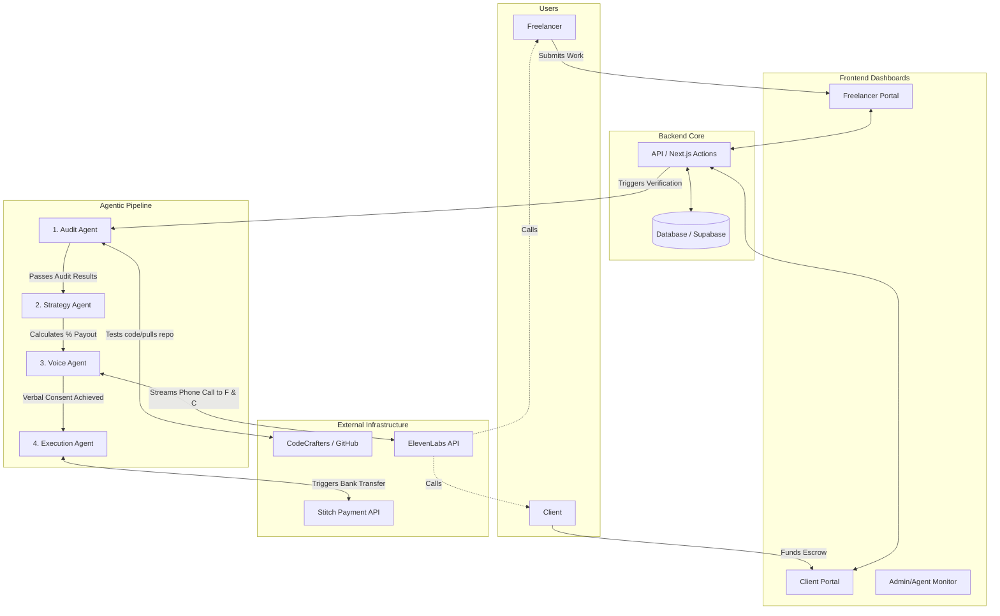
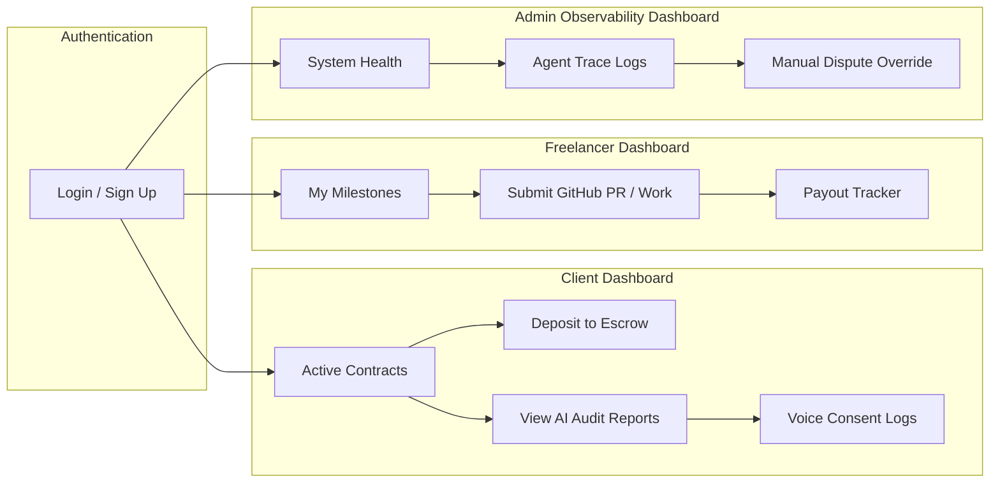
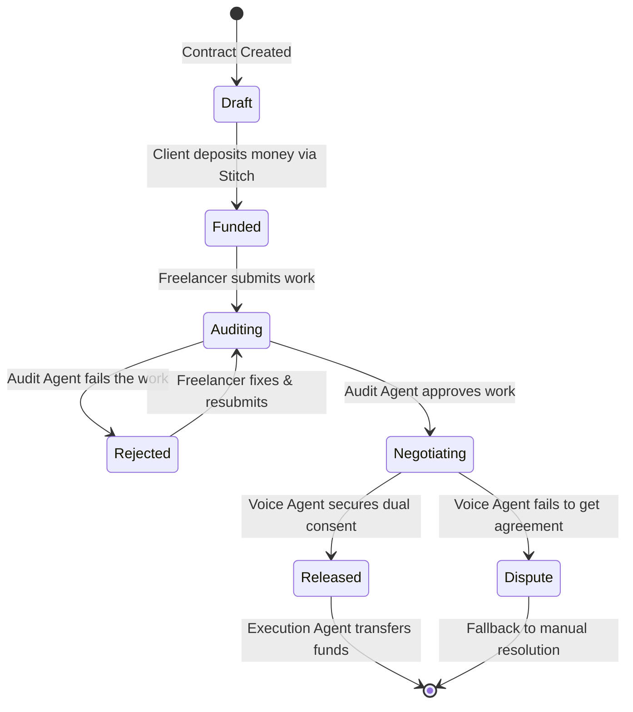

# EscrowGuard Architecture & Dashboard Ecosystem

Based on the problem statement, here is the complete solution architecture mapped out across three distinct Mermaid diagrams. We break this down into the **Core System Pipeline**, the **3 Dashboard UI Architecture**, and the **Milestone State Machine**.

> [!TIP]
> This architecture separates the complex AI agent logic from the frontend dashboards. The users (Freelancers and Clients) never directly interact with the AI logic—they just submit work and receive phone calls, while the agents work autonomously in the background.

## 1. Core System & Agent Pipeline
This diagram shows how the 4 agents connect to external APIs and process the work.

---

## 2. The 3 Dashboards: Pages & Navigation
As you suggested, we need exactly 3 dashboards. 
1. **Client Dashboard**: For managing money and seeing audit results.
2. **Freelancer Dashboard**: For submitting work and tracking payouts.
3. **Admin Observability**: For developers to monitor the AI agents in real-time.

---

## 3. Escrow Milestone Lifecycle (State Machine)
This maps the exact states a project goes through. This is crucial for your database schema (e.g., an `status` enum column on your `Milestones` table).

> [!IMPORTANT]
> **Next Steps for Development**
> 1. Set up the routes for the 3 dashboards (`/app/dashboard/client`, `/app/dashboard/freelancer`, `/app/dashboard/admin`).
> 2. Build the state tracking in the database (`status: 'FUNDED' | 'AUDITING' | 'NEGOTIATING' | 'RELEASED'`).
> 3. Connect the Voice Agent webhook so that when ElevenLabs finishes the call, it triggers the Execution Agent.
